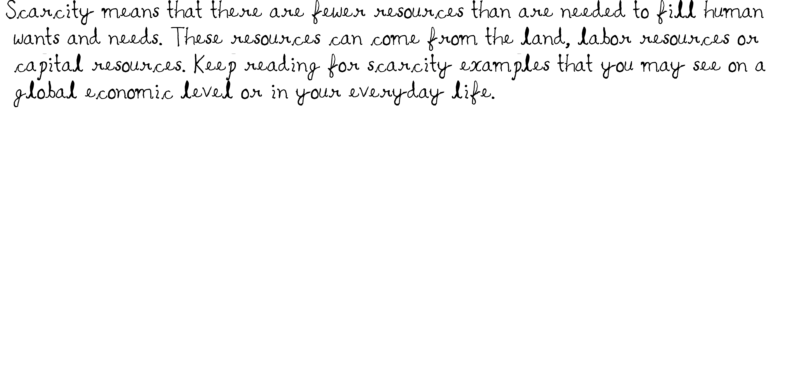

# Text to handwriting using Python
A python program to convert some given text to a natural handwritten looking image.

## Installation and Setup
```
git clone https://github.com/whoparthgarg/House-Price-Prediction
```
## Input
Scarcity means that there are fewer resources than are needed to fill human wants and needs. These resources can come from the land, labor resources or capital resources. Keep reading for scarcity examples that you may see on a global economic level or in your everyday life.

## Output
<center></center>
